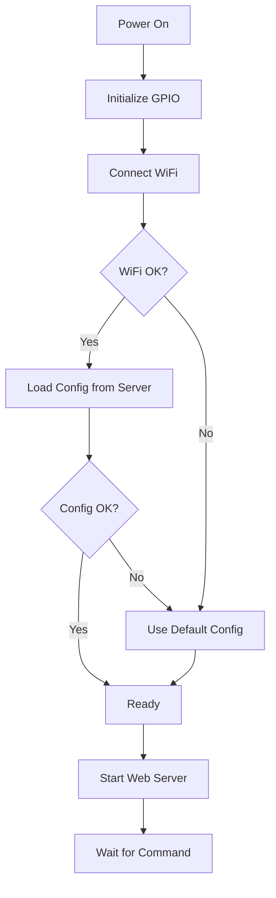
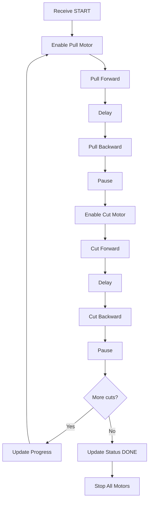

# ESP8266 - Alat Pemotong Kertas Roll

Dokumentasi dan kode untuk implementasi ESP8266 sebagai controller motor untuk alat pemotong kertas roll yang terintegrasi dengan sistem HMI berbasis web.

---

## 📁 File Structure

```
ESP8266/
├── README.md                  ← Anda di sini
├── routing                    ← Quick reference pin mapping
├── ROUTING_PINOUT.md         ← Detail lengkap koneksi hardware
├── WIFI_CONFIG.md            ← Panduan konfigurasi WiFi & upload
├── pemotong_kertas.ino       ← Arduino sketch utama
├── debug_hardware.ino        ← 🔧 Hardware debugger & tester
├── DEBUG_GUIDE.md            ← Panduan penggunaan debugger
├── config_template.ino       ← Template konfigurasi
└── INTEGRATION_SUMMARY.md    ← Ringkasan integrasi lengkap
```


---

## 🎯 Fitur

### Hardware Control
- ✅ Control 2 motor stepper (Penarik & Pemotong)
- ✅ Driver A4988 dengan microstepping
- ✅ Pin GPIO disesuaikan untuk ESP8266
- ✅ Enable/disable motor untuk hemat power

### Network & Integration
- ✅ WiFi connectivity untuk komunikasi dengan server
- ✅ HTTP Client untuk request konfigurasi dari API
- ✅ Web Server untuk menerima perintah cutting
- ✅ Real-time progress update ke database
- ✅ Auto-load configuration dari server

### Smart Features
- ✅ Auto-reconnect WiFi jika terputus
- ✅ Fallback ke default config jika server tidak tersedia
- ✅ Watchdog handling untuk ESP8266
- ✅ Status monitoring via web interface

---

## 🔌 Pin Configuration

### Motor Pemotong Kertas (Cut Motor)

| NodeMCU | GPIO | A4988  | Fungsi |
|---------|------|--------|--------|
| D5      | 14   | DIR    | Arah   |
| D6      | 12   | STEP   | Step   |
| D7      | 13   | ENABLE | Enable |

### Motor Penarik Kertas (Pull Motor)

| NodeMCU | GPIO | A4988  | Fungsi |
|---------|------|--------|--------|
| D2      | 4    | ENABLE | Enable |
| D3      | 0    | DIR    | Arah   |
| D4      | 2    | STEP   | Step   |

> 📖 **Detail lengkap:** Lihat [ROUTING_PINOUT.md](ROUTING_PINOUT.md)

---

## 🚀 Quick Start

### 1. Persiapan Hardware

1. **Pasang ESP8266 ke breadboard/PCB**
2. **Hubungkan ke A4988 drivers** sesuai tabel pin di atas
3. **Sambungkan motor stepper** ke output A4988
4. **Power:**
   - 12V DC untuk A4988 dan motor
   - 5V USB untuk ESP8266 (atau 3.3V regulated)
   - **PENTING:** Common ground antara ESP8266, A4988, dan PSU!

⚠️ **JANGAN sambungkan ESP8266 langsung ke 12V!**

### 2. Setup Software

#### Install Arduino IDE & Libraries

1. Install Arduino IDE (versi 1.8.x atau 2.x)
2. Install ESP8266 board:
   - Tools → Board Manager → Search "ESP8266" → Install
3. Install libraries:
   - **ArduinoJson** (v6.x)
   - ESP8266WiFi ✅ (included)
   - ESP8266HTTPClient ✅ (included)
   - ESP8266WebServer ✅ (included)

#### Configure WiFi

Edit file `pemotong_kertas.ino` baris 20-22:

```cpp
const char* ssid = "NAMA_WIFI_ANDA";        // ← Ganti ini
const char* password = "PASSWORD_WIFI_ANDA"; // ← Ganti ini
const char* serverURL = "http://192.168.1.7/pemotongKertas/api"; // ← Ganti IP
```

> 📖 **Panduan lengkap:** Lihat [WIFI_CONFIG.md](WIFI_CONFIG.md)

### 2.5. 🔧 Testing dengan Debugger (RECOMMENDED!)

**Sebelum upload program utama, sangat disarankan untuk test hardware terlebih dahulu!**

1. **Upload** file `debug_hardware.ino` ke ESP8266
2. **Buka Serial Monitor** (115200 baud)
3. **Jalankan** semua test (otomatis di awal)
4. **Verifikasi** semua test PASS:
   - ✅ Pin Output
   - ✅ Pull Motor
   - ✅ Cut Motor
   - ✅ WiFi Connection
   - ✅ API Connection

> 📖 **Panduan lengkap:** Lihat [DEBUG_GUIDE.md](DEBUG_GUIDE.md)

**Jika ada test yang FAIL, perbaiki dulu sebelum lanjut ke program utama!**

### 3. Upload Program Utama

Setelah semua test debugger PASS:

1. Hubungkan ESP8266 via USB
2. Pilih board: **NodeMCU 1.0 (ESP-12E Module)**
3. Pilih Port: COM port yang terdeteksi
4. Upload speed: **115200**
5. Klik Upload ▶️

### 4. Verifikasi

Buka Serial Monitor (115200 baud) dan pastikan muncul:

```
========================================
Paper Cutting Machine ESP8266 v1.0
========================================

✓ GPIO pins initialized
Connecting to WiFi: YourWiFi
✓ WiFi connected successfully!
========================================
  IP ADDRESS: 192.168.1.150
  Signal Strength: -45 dBm
========================================
✓ HTTP Server started on port 80
✓ Configuration loaded successfully!

========================================
Setup Complete! Ready to operate.
========================================
```

---

## 🌐 API Endpoints

ESP8266 menyediakan web server dengan endpoints berikut:

### GET `/`
Web interface untuk monitoring status

**Response:** HTML page dengan status mesin

---

### GET `/status`
Mendapatkan status mesin saat ini

**Response:**
```json
{
  "success": true,
  "status": "READY",
  "cut_count": 0,
  "total": 0,
  "job_id": 0,
  "ip": "192.168.1.150"
}
```

---

### GET `/start`
Memulai job pemotongan

**Parameters:**
- `panjang` - Panjang potongan dalam mm (required)
- `jumlah` - Jumlah potongan (required)
- `job_id` - ID job dari database (optional)

**Example:**
```
http://192.168.1.150/start?panjang=100&jumlah=10&job_id=5
```

**Response:**
```json
{
  "success": true,
  "message": "Job started",
  "data": {
    "panjang": 100,
    "jumlah": 10,
    "job_id": 5
  }
}
```

---

### GET `/stop`
Menghentikan job yang sedang berjalan

**Response:**
```json
{
  "success": true,
  "message": "Job stopped"
}
```

---

## 🔄 Integrasi dengan API Server

ESP8266 berkomunikasi dengan API server (PHP) untuk:

### 1. Get Configuration
**Endpoint:** `GET /api/get_config.php`

Dijalankan saat:
- ESP8266 boot/restart
- Manual refresh (jika diimplementasikan)

Mendapatkan:
- Diameter roller
- Jarak tarik
- Jumlah steps
- Delay timing
- Pause duration

### 2. Update Progress
**Endpoint:** `POST /api/progress.php`

Dijalankan setiap:
- Selesai 1 potongan
- Job selesai
- Job dihentikan

Mengirim:
```json
{
  "job_id": 5,
  "potong_ke": 3,
  "status": "RUNNING",
  "panjang_mm": 100
}
```

---

## 🔧 Configuration Variables

ESP8266 menyimpan konfigurasi dalam struct `MachineConfig`:

| Variable | Type | Default | Description |
|----------|------|---------|-------------|
| `roller_diameter_mm` | int | 17 | Diameter roller (mm) |
| `pull_distance_cm` | int | 5 | Jarak tarik kertas (cm) |
| `pull_steps` | int | 320 | Jumlah steps motor penarik |
| `pull_delay_ms` | int | 500 | Delay setelah tarik (ms) |
| `cut_delay_ms` | int | 500 | Delay setelah potong (ms) |
| `step_delay_us` | int | 1200 | Delay per step (µs) |
| `pull_pause_ms` | int | 1000 | Pause setelah tarik mundur (ms) |
| `cut_pause_ms` | int | 2000 | Pause setelah potong mundur (ms) |

Konfigurasi dapat diubah via dashboard web tanpa upload ulang firmware!

---

## 📊 Alur Kerja (Workflow)

### Boot Sequence



### Cutting Cycle



---

## 🐛 Troubleshooting

### WiFi tidak connect
- ✅ Pastikan SSID dan password benar
- ✅ Cek jarak ESP8266 ke router
- ✅ Restart ESP8266 (tekan tombol RESET)
- ✅ Cek serial monitor untuk error message

### Config tidak ter-load
- ✅ Pastikan IP server benar
- ✅ Cek apakah Laragon/Apache running
- ✅ Test akses API via browser: `http://[SERVER_IP]/pemotongKertas/api/get_config.php`
- ✅ Periksa database connection di PHP

### Motor tidak bergerak
- ✅ Cek koneksi kabel GPIO ke A4988
- ✅ Pastikan A4988 mendapat power 12V
- ✅ Cek motor connector tidak terbalik
- ✅ Adjust VREF pada A4988 (current limiting)
- ✅ Pastikan ENABLE pin LOW saat motor aktif

### ESP8266 restart terus
- ✅ Power supply tidak cukup (min 500mA)
- ✅ Gunakan USB cable yang bagus
- ✅ Tambahkan capacitor 100µF di VCC-GND
- ✅ Cek tidak ada short circuit

### HTTP timeout
- ✅ Server PHP terlalu lambat
- ✅ Network congestion
- ✅ Naikkan timeout value di code (default 5s)

---

## ⚙️ Advanced Configuration

### Mengubah Microstepping

Default setting code menggunakan delay yang cocok untuk **half-step mode**.

Jika Anda mengubah DIP switch A4988 ke mode lain:

| Mode | MS1 | MS2 | MS3 | Multiplier | Recommended `step_delay_us` |
|------|-----|-----|-----|------------|----------------------------|
| Full | OFF | OFF | OFF | 1x | 2000 |
| Half | ON | OFF | OFF | 2x | 1200 (default) |
| 1/4 | OFF | ON | OFF | 4x | 800 |
| 1/8 | ON | ON | OFF | 8x | 600 |
| 1/16 | ON | ON | ON | 16x | 400 |

Update via dashboard web: Settings → Machine Configuration

### Kalibrasi Steps

Formula untuk menghitung `pull_steps`:

```
circumference = π × diameter_mm / 10  (dalam cm)
steps_per_cm = 200 / circumference
pull_steps = pull_distance_cm × steps_per_cm
```

Contoh untuk roller 17mm, jarak 5cm:
```
circumference = 3.14 × 17 / 10 = 5.338 cm
steps_per_cm = 200 / 5.338 = 37.48
pull_steps = 5 × 37.48 = 187.4 ≈ 187
```

Kalikan dengan microstepping factor!
- Half-step: 187 × 2 = **374 steps**

---

## 📚 Dokumentasi Terkait

| File | Keterangan |
|------|------------|
| [ROUTING_PINOUT.md](ROUTING_PINOUT.md) | Detail koneksi pin dan wiring diagram |
| [WIFI_CONFIG.md](WIFI_CONFIG.md) | Panduan setup WiFi dan upload sketch |
| [../API_REFERENCE.md](../API_REFERENCE.md) | Dokumentasi API server (PHP) |
| [../HARDWARE_CONNECTIONS.md](../HARDWARE_CONNECTIONS.md) | Referensi hardware (ESP32) |
| [../QUICK_START.md](../QUICK_START.md) | Panduan cepat sistem keseluruhan |

---

## 🔐 Security Notes

⚠️ **PENTING:**
- ESP8266 tidak menggunakan autentikasi (untuk kemudahan testing)
- Jangan expose ke internet publik!
- Gunakan dalam jaringan lokal/private saja
- Untuk production, tambahkan:
  - Basic authentication
  - API key validation
  - HTTPS (jika perlu)

---

## 📝 Changelog

### v1.0.0 (20 Januari 2026)
- ✅ Initial release
- ✅ WiFi connectivity
- ✅ API integration dengan PHP backend
- ✅ Web server untuk remote control
- ✅ Auto-load configuration
- ✅ Progress reporting
- ✅ Dual motor control (Pull & Cut)

---

## 👨‍💻 Development

### Modifikasi Code

Struktur code terorganisir dengan section yang jelas:

```
LIBRARY & INCLUDE        → Dependencies
PIN DEFINISI             → Pin mapping
WIFI CONFIGURATION       → Network settings
STRUKTUR DATA           → Data structures
SETUP FUNGSI            → Initialization
MAIN LOOP               → Main program loop
WIFI CONNECTION         → WiFi functions
LOAD CONFIG             → Configuration management
MOTOR CONTROL           → Motor movement functions
WEB SERVER HANDLERS     → HTTP endpoints
STATUS UPDATE           → API communication
```

Setiap fungsi memiliki komentar yang jelas. Silakan modifikasi sesuai kebutuhan!

---

## 🆘 Support

Jika mengalami masalah:

1. **Cek Serial Monitor** untuk error messages
2. **Baca dokumentasi** di folder ini
3. **Test step-by-step:**
   - WiFi connection
   - API connectivity
   - Hardware wiring
   - Motor movement

---

**Version:** 1.0.0  
**Last Updated:** 20 Januari 2026  
**Platform:** ESP8266 (NodeMCU / Wemos D1 Mini)  
**License:** MIT
